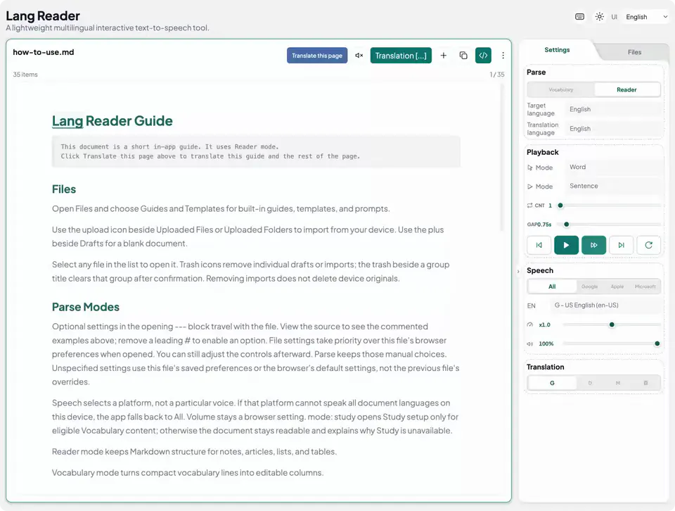

# Lang Reader

A language-learning web app for reading and vocabulary practice using your own Markdown notes.

Online app: [https://hao-yicheng.github.io/lang-reader/](https://hao-yicheng.github.io/lang-reader/)

[](docs/images/lang-reader-demo.webm?raw=true)

<br>

## Features

### Modes

| Feature | Reader | Vocabulary | Study (Vocabulary) |
| --- | --- | --- | --- |
| Format | .md, .txt | .md, .txt, .csv, .tsv | Same as Vocabulary |
| Interaction | Click and keyboard shortcuts | Click and keyboard shortcuts | Click and keyboard shortcuts |
| Columns | — | Change type and language; resize, hide and mute | — |
| Reading units | Word, Sentence, Paragraph | Word, Sentence, Cell | Card-based pronunciation |
| Exercises | — | — | Learn / Recall / Dictation |
| Progress backup | — | — | JSON import and export |

### Files

| Source | What you can do |
| --- | --- |
| Guides and Templates | Usage guide, document examples and a reformatting prompt. |
| Drafts | Create or copy Markdown documents; edit and download them. |
| Local Files | Edit JSON files in `config/` to load local files and folders. |
| Uploaded Files | Upload files and folders, supporting nested folders. |

### Settings

<table>
  <thead>
    <tr><th>Area</th><th>Option</th><th>Description</th></tr>
  </thead>
  <tbody>
    <tr><td rowspan="2">Parse</td><td>Mode</td><td>Reader / Vocabulary / Study (Vocabulary practice).</td></tr>
    <tr><td>Language</td><td>Target: document reading language. Translation: translation reading language.</td></tr>
    <tr><td rowspan="4">Playback</td><td>Click Mode</td><td>Word / Sentence / Paragraph / Cell.</td></tr>
    <tr><td>Play Mode</td><td>Play / Auto Play: Word / Sentence / Paragraph.</td></tr>
    <tr><td>Loop Count</td><td>1–20 / ∞.</td></tr>
    <tr><td>Unit Gap</td><td>0.25 / 0.5 / 0.75 / 1, then 2–30 seconds.</td></tr>
    <tr><td rowspan="3">Speech</td><td>Provider + Voice</td><td>Filter voices by All / Google / Apple / Microsoft, then choose voices for Target and Translation.</td></tr>
    <tr><td>Speed</td><td>0.5–3×.</td></tr>
    <tr><td>Volume</td><td>0–100%.</td></tr>
    <tr><td>Translation</td><td>External tools</td><td>Google Translate / DeepL / Microsoft Translator / Baidu Translate.</td></tr>
  </tbody>
</table>

<br>

## Keyboard Shortcuts

<table>
  <tbody>
    <tr><th colspan="2" align="center">Playback</th></tr>
    <tr><td>Space / Return</td><td>Play / Pause</td></tr>
    <tr><td>Shift + Space / Shift + Return</td><td>Auto Play / Pause</td></tr>
    <tr><td>Esc</td><td>Stop playback</td></tr>
    <tr><td>L</td><td>Cycle Loop Count</td></tr>
    <tr><th colspan="2" align="center">Navigation and Mode</th></tr>
    <tr><td>Arrow keys</td><td>Navigate cells / blocks</td></tr>
    <tr><td>W / S</td><td>Word / Sentence mode</td></tr>
    <tr><td>Hold Alt / Option</td><td>Temporary Word mode</td></tr>
    <tr><td>T</td><td>Translate current unit</td></tr>
    <tr><th colspan="2" align="center">Study</th></tr>
    <tr><td>↑ / ↓</td><td>Primary action / Don't know</td></tr>
    <tr><td>← / →</td><td>Previous / next card</td></tr>
    <tr><td>Return</td><td>Primary action</td></tr>
  </tbody>
</table>

<br>

## Deploy Locally

Requires Node.js and npm.

```bash
npm install
npm run serve
```

The app runs at [http://127.0.0.1:5173/](http://127.0.0.1:5173/) or [http://localhost:5173/](http://localhost:5173/).

### Config

Edit `config/app.config.example.json`, or create `config/app.config.json` for your settings.

**Local Documents:** Set `local.enabled` to `true` and put files or folders in `local-default/`; customize `local.defaultSources`, `local.otherSources` and `local.exclude` as needed.

**Local Study Progress Files:** Also set `study.localPersistence` to `true` and run `npm run serve:study`; saves go to `local-default/study-data/`.

<br>

## Browser and Data Notes

- Available voices depend on the browser and system.
- Drafts and Study progress are stored in the browser. Download documents and export progress before clearing site data.
